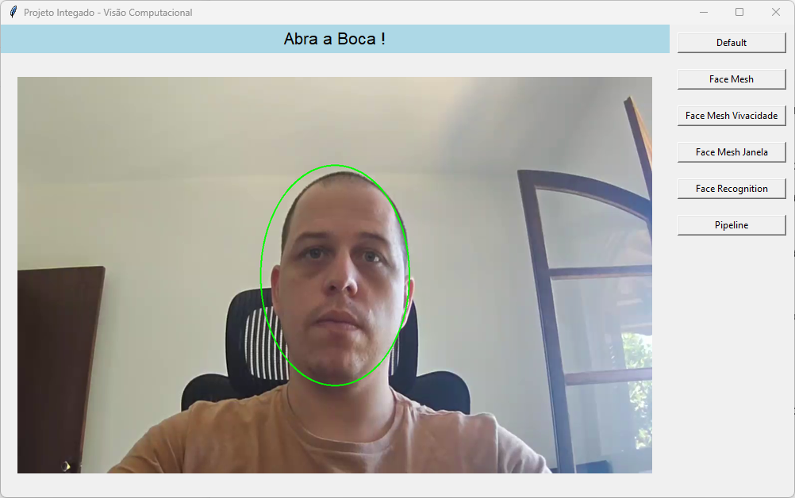

# Desafio Computer Vision - Quantum Finance Autenticação Facial

### Participantes: 

| Nome                                 | RM     |
|--------------------------------------|--------|
| Gabriela Schroder de Barros         | 353512 |
| Rodrigo Broslavschi de Oliveira      | 353534 |
| Yuko Suga                            | 355013 |

## Descrição
O setor de fraudes apontou que existem clientes que se queixaram de não contratar serviços específicos, como o crédito pessoal. No entanto, os protocolos de segurança da senha foram realizados em conformidade, cada cliente autenticou com sua própria senha.​ Em função disso, o banco precisa arcar com reembolsos e medidas de contenção para evitar processos judiciais, pois os clientes alegam terem sido invadidos por hackers ou algo similar.​

Além da senha, podemos implementar formas de autenticação complementares, a depender do serviço, que utilizasse uma verificação e identificação facial. Caso o cliente não seja autenticado, ele será atendido por uma esteira dedicada eo as evidências da não identificação serão encaminhadas para a área de IA para validação dos parâmetros e limiares para aperfeiçoamento do modelo.

Será necessário construir:​

Detector de faces​  
Identificação de faces​  
Detecção de vivacidade (liveness) para evitar que um fraudador utilize uma foto estática.  

Grave um video da aplicação sendo executada e envie.
---

## Estrutura do Projeto
O projeto utiliza **Tkinter** para a interface gráfica e as bibliotecas **face_recognition** e **mediapipe** para as funções de detecção, reconhecimento e vivacidade facial.

### Componentes do Projeto
- **arq/:** Contém o arquivo `encodings.pkl`, que armazena os dados treinados para reconhecimento facial.
- **src/camera.py:** Código com a lógica para reconhecimento e detecção de faces.
- **run.py:** Arquivo principal que implementa a interface gráfica.
- **encodings.py:** Script para gerar o arquivo `encodings.pkl`, utilizado no reconhecimento facial.

---

## Preparação do Ambiente

### Criação do Ambiente Virtual
```bash
python -m venv venv
```

### Instalação das Dependências
```bash
pip install -r requirements.txt
```

---

## Execução do Software
Para executar a aplicação:
```bash
python run.py
```

---

## Funcionalidades

### Tela Inicial da Interface
A interface inicial apresenta as funcionalidades disponíveis.


### Aplicações
1. **FaceMesh**: Para detecção de pontos faciais.
   

2. **Detecção de Vivacidade**: Valida a vivacidade do rosto.
   

3. **Enquadramento Facial**: Orienta o enquadramento correto do rosto.
   - Rosto Enquadrado  
     
   - Rosto Não Enquadrado  
     

4. **Reconhecimento Facial**: Realiza a identificação do rosto.
   

---

## Pipeline do Sistema
O pipeline demonstra o funcionamento completo do sistema:
1. O usuário ajusta o rosto dentro da elipse.  
   

2. O sistema solicita que o usuário abra a boca para o teste de vivacidade.  
   

3. Após validar a vivacidade, o sistema identifica a face.  
   

---

## Geração do Arquivo de Identificação Facial
A identificação facial utiliza o modelo **face_recognition** e o arquivo `encodings.pkl`. Para gerar esse arquivo:

1. Insira as imagens dos usuários na pasta `arq/imagens/<nome_usuario>`.
2. Execute o script para criar o arquivo `arq/encodings.pkl`:
   ```bash
   python encodings.py
   ```
--- 

## Conclusão
Este projeto visa demonstrar a aplicação de autenticação facial com detecção de vivacidade, garantindo maior segurança e reduzindo fraudes em serviços bancários.
